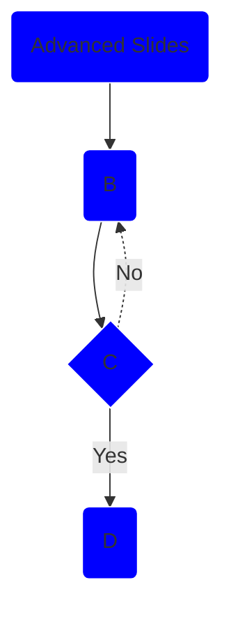

#### Advanced Slides Doc Walkthrough

---

Greetings from second slide.

---

#### These are some annotations

<style>
	.with-border{
		border: 1px solid red;
	}
</style>
text with border <!-- element class="with-border" -->

text with border <!-- element style="border: 1px solid green" -->

text with background <!-- element style="background:blue" -->

text with attribute <!-- element data-toggle="modal" -->

---

<!-- .slide: style="background-color: coral;" -->

# Header with coral background color

Paragraph has coral background color, too!

---

::: block

#### Header
_and_
Paragraph content
*in same block*

:::

---
### block can be used to scope styles

no color

::: block <!-- element style="background-color: red;" -->

everything inside this block has red background color

::: block <!-- element style="background-color: blue;" -->

blue

:::

red

:::

no color

[mszturc.github.io/obsidian-advanced-slides/extend-syntax/blockcomment/](https://mszturc.github.io/obsidian-advanced-slides/extend-syntax/blockcomment/)

---

Fade in <!-- element class="fragment" -->

Fade out <!-- element class="fragment fade-out" -->

Highlight red <!-- element class="fragment highlight-red" -->

Fade in, then out <!-- element class="fragment fade-in-then-out" -->

Slide up while fading in <!-- element class="fragment fade-up" -->

---

- Permanent item
- Appear Fourth <!-- element class="fragment" data-fragment-index="4" -->
- Appear Third <!-- element class="fragment" data-fragment-index="3" -->
- Appear Second <!-- element class="fragment" data-fragment-index="2" -->
- Appear First <!-- element class="fragment" data-fragment-index="1" -->

---

<!-- slide bg="aquamarine" -->
## Slide color text based background

---

[<!-- slide bg="https://picsum.photos/seed/picsum/800/600" -->
## Slide with image background

---

<!-- slide bg="https://picsum.photos/seed/picsum/800/600" data-background-opacity="0.5" -->
## Slide with image background

---

## My Slide

This is part of my Presentation

Hit S in the browser to see the notes


note: this is not! Only the speaker might see this text.

- and this bulletpoint
- or this picture


---


<!-- .slide: bg="white"-->

🌐


## Icons

---

<!-- .slide: bg="white"-->
### Basic Syntax

<!-- .element: color="coral"-->

Short Syntax

	<!-- .element: color="coral"-->

HTML Synthax

 	<i color="coral" class="fas fa-envelope fa-4x"/>

ShortCode Synthax

	:fas_envelope:
 
---

# Sizing

<i class="fas fa-camera fa-xs"></i>
<i class="fas fa-camera fa-sm"></i>
<i class="fas fa-camera fa-lg"></i>
<i class="fas fa-camera fa-2x"></i>
<i class="fas fa-camera fa-3x"></i>
<i class="fas fa-camera fa-5x"></i>
<i class="fas fa-camera fa-7x"></i>

---

# Rotating Icons

<i class="fas fa-snowboarding"></i>
<i class="fas fa-snowboarding fa-rotate-90"></i>
<i class="fas fa-snowboarding fa-rotate-180"></i>
<i class="fas fa-snowboarding fa-rotate-270"></i>
<i class="fas fa-snowboarding fa-flip-horizontal"></i>
<i class="fas fa-snowboarding fa-flip-vertical"></i>
<i class="fas fa-snowboarding fa-flip-both"></i>
  
---
  
  # Animating Icons
  
<i class="fas fa-spinner fa-spin fa-3x"></i>
<i class="fas fa-circle-notch fa-spin fa-3x"></i>
<i class="fas fa-sync fa-spin fa-3x"></i>
<i class="fas fa-cog fa-spin fa-3x"></i>
<i class="fas fa-spinner fa-pulse fa-3x"></i>
<i class="fas fa-stroopwafel fa-spin fa-3x"></i>
  
  
---

#### Bordered + Pulled Icons

<i class="fas fa-quote-left fa-2x fa-pull-left"></i>

Gatsby believed in the green light, the orgastic future that year by year recedes before us.
It eluded us then, but that’s no matter — tomorrow we will run faster, stretch our arms further...
And one fine morning — So we beat on, boats against the current, borne back ceaselessly into the past.<!-- .element: style="font-size: 24px" align="justify" -->

<br>

<i class="fas fa-arrow-right fa-2x fa-pull-right fa-border"></i>

Gatsby believed in the green light, the orgastic future that year by year recedes before us.
It eluded us then, but that’s no matter — tomorrow we will run faster, stretch our arms further...
And one fine morning — So we beat on.<!-- .element: style="font-size: 46px" align="justify" -->

---

### Emojis

:smile: => 😄

---

```chart
    type: bar
    labels: [Monday,Tuesday,Wednesday,Thursday,Friday, Saturday, Sunday, "next Week", "next Month"]
    series:
      - title: Title 1
        data: [1,2,3,4,5,6,7,8,9]
      - title: Title 2
        data: [5,4,3,2,1,0,-1,-2,-3]
```

---

<canvas data-chart="line" >
<!--
{
 "data": {
	  "labels": ["January"," February"," March"," April"," May"," June"," July"],
	  "datasets":[
		   {
			    "data":[65,59,80,81,56,55,40],
			    "label":"My first dataset","backgroundColor":"rgba(20,220,220,.8)"
		   },
		   {
			    "data":[28,48,40,19,86,27,90],
			    "label":"My second dataset","backgroundColor":"rgba(220,120,120,.8)"
		   }
	  ]
 }
}
-->
</canvas>

---

Auto animation

<!-- .slide: data-auto-animate -->
# Title

---
<!-- .slide: data-auto-animate -->

# Title
##### **Subtitle**
###### *Author - 2022* 

---

## Add a note to a slide


<!-- slide template="[[Computed variables in R]]" bg="black" -->


---

### Embed slides in a note

```slide
{
	slide: [[2023-04-09]],
	page: 1,1
}
```

---

#### even

By setting the even attribute the Content of the split element gets divided evenly:

<split even%3E

 
 
 
</split>

---

#### gap

By adding the gap attribute there will be a gap between each element:

<split even gap="3">

**Lorem Ipsum** is simply dummy text of the printing and typesetting industry. Lorem Ipsum has been the industry's standard dummy text ever since the 1500s

when an unknown printer took a galley of type and scrambled it to make a type specimen book. It has survived not only five centuries, but also the leap

into electronic typesetting, remaining essentially unchanged. It was popularised in the 1960s with the release of Letraset sheets containing Lorem
</split>

---

#### left & right

If you want to split a slide proportionally you can do that with left and right attributes. Left and right represent the proportions of the slide columns:

<split left="2" right="1" gap="2">

**Lorem Ipsum** is simply dummy text of the printing and typesetting industry. Lorem Ipsum has been the industry's standard dummy text ever since the 1500s
when an unknown printer took a galley of type and scrambled it to make a type specimen book. It has survived not only five centuries, but also the leap
	
into electronic typesetting, remaining essentially unchanged. It was popularised in the 1960s with the release of Letraset sheets containing Lorem
</split>

---

#### wrap

By adding a wrap attribute you can define after how many children an new row should start:

<split wrap="4">

 

 

 

 

 

 
</split>

---

### Embed mermaid charts



---

### no-margin

By adding no margin attribute automatic gaps between rows and column gets removed:

<split no-margin>

 
 
 
 
 
 
 
 
</split>

---

#### Position by Coordinates

Both positive and negative values can be set for _x_ and _y_ on the **drop** property. The meaning of positive and negative values in each case is summarized as follows:

-   A positive x value indicates a position relative to the left edge of the slide.
-   A negative x value indicates a position relative to the right edge of the slide.
-   A positive y value indicates a position relative to the top edge of the slide.
-   A negative y value indicates a position relative to the bottom edge of the slide.

---

<grid drag="60 55" drop="5 10" bg="red">
60 x 55
</grid>

<grid drag="25 55" drop="-5 10" style=bg="green">
25 x 55
</grid>

<grid drag="90 20" drop="5 -10" bg="gray">
90  x 20
</grid>

---

#### Position by Name

Some common grid positions have been named for your convenience. Named positions can be used in place of _x_ and _y_ coordinates on the **drop** property. The following named positions are currently defined:

- center
- top
- bottom
- left
- right
- topleft
- topright
- bottomleft
- bottomright

---

<grid drag="40 30" drop="topleft" bg="red">
Top Left
</grid>

<grid drop="right" bg="green">
Right with default size
</grid>

<grid drag="80 30" drop="bottom" bg="coral">
Bottom
</grid>

---

#### Column Flow

When `flow="col"` the following layout and spacing behaviors occur within the grid:

-   Children are rendered vertically within the grid
-   An equal amount of space is injected between each child
-   An equal amount of space is injected at the start and end of the grid

---

[<grid  drag="50 100" drop="center" bg="coral" flow="col">
Heading
]
**Lorem Ipsum** is simply dummy text
</grid>

---

#### Row Flow

When `flow=row` the following layout and spacing behaviors occur within the grid:

-   Children are rendered horizontally within the grid.
-   An equal amount of space is injected between each child
-   An equal amount of space is injected at the start and end of the grid

The following sample slide helps to clarify this concept. Note, the grid width here is 100% of the slide width:

---

<grid  drag="100 40" drop="center" bg="coral" flow="row">
Heading
]
**Lorem Ipsum** is simply dummy text
</grid>>

---

### Attributes

#### Background

The grid bg property is used to define a custom background for a grid. Children added to the grid are rendered on top of the background.

Also demonstrates rotate

---


<grid  drag="55 50" drop="topleft" bg="orange">
### Make
</grid>

### Noise <!-- element drag="55 50" drop="bottomright" bg="rgb(0,0,0)"-->

<grid  drag="25 20" drop="center" bg="green" rotate="-15">
### some
</grid>

---

#### Border

The grid border property is used to define a custom border for a grid section. Custom borders can help to highlight or differentiate grids on your slide.

Where the **width** option of the **border** property takes values of _thin_, _medium_, _thick_ or a pixel value such as **10px**. The style option takes values of _dotted_, _solid_, _dashed_, _inset_, or _outset_. And the **color** option takes any valid [CSS Color Value](https://developer.mozilla.org/en-US/docs/Web/CSS/color_value).

---

<grid  drag="30 25" drop="left" border="thick dotted blue">
thick dotted blue
</grid>

<grid  drag="30 25" drop="center" border="4px solid white">
20px solid white
</grid>

thick dotted blue <!-- element drag="30 25" drop="right" border="medium dashed red"-->

---

#### Fragments

The grid frag property is used to define fragments for grid. Fragments are used to highlight or incrementally reveal individual elements on a slide.

---

<grid drag="60 55" drop="5 10" bg="red">
### Fragments:
+ Right
+ Bottom
</grid>

<grid drag="25 55" drop="-5 10" bg="green" frag="1">
Right Grid
</grid>

<grid drag="90 20" drop="5 -10" bg="gray" frag="2">
Bottom Grid
</grid>

---

#### Filter

The grid filter property is used to define filter effects for a grid section. Filter effects on a grid section also affect all associated children.

```
<grid  drag="width height" drop="x y" filter="effect">
```

Where the **effect** option of the **filter** property can take one of the following types:

-   blur
-   bright
-   contrast
-   grayscale
-   hue
-   invert
-   saturate
-   sepia

---

<grid  drag="50 50" drop="-12 -25" bg="white" filter="sepia()">
]
</grid>

Text is too blurry <!-- element drag="30 25" drop="5 15" bg="#B565A7" filter="blur(10px)" -->

---


