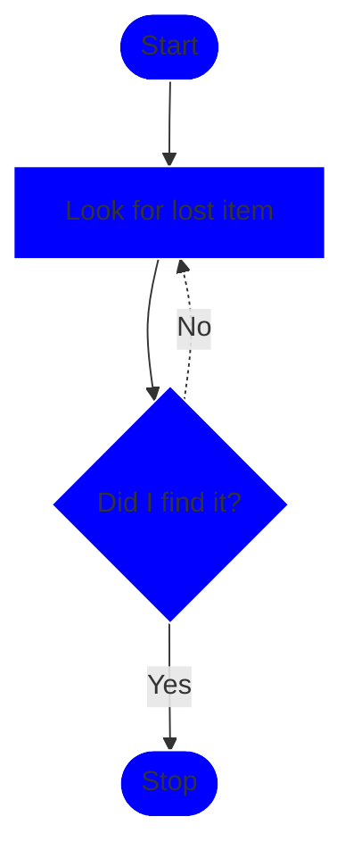
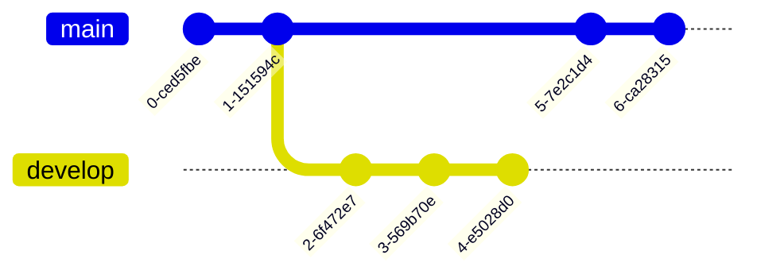
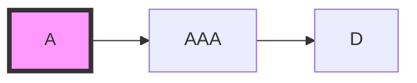
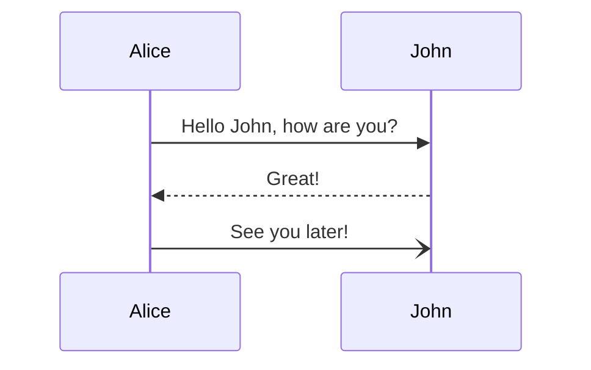

up:: [[Obsidian]]
tags:: #note/reference #source/documentation 
X:: 

## mermaid.js

#### Flowchart

Git graph

---
### References

[Styling a Node from docs](https://github.com/mermaidjs/mermaid-gitbook/blob/master/content/flowchart.md#styling-a-node)

