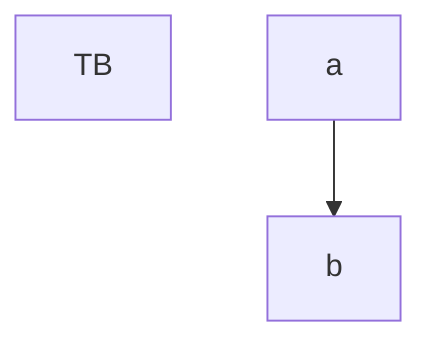

```mermaid
graph 
TB
a --> b
```

```mermaid
graph LR;
    A-->B[AAA];
    B-->D;

    %% Class Definitions
    %% =================
    class A cssClass;
    classDef cssClass fill:#f9f,stroke:#333,stroke-width:4px, font-size:15px;
```
