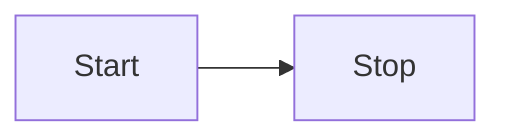
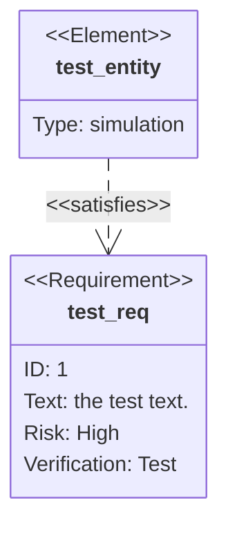

# Intro to Obsidian and Notetaking Outline

---
## What we will cover

About this class

1. Course Welcome 
2. About me 

Data Science student 
Background in International Finance, Admin and software localization 
Application Development in JavaScript and Python 
Teacher

1. Introduction to Obsidian
	1. What is Obsidian/Use case
	2. Installing Obsidian
	3. Making your first note
	4. Basics of markdown
2. Introduction to notetaking
	1. Zettelkasten
	2. Atomic notes
3. Organizing notes
	1. Backlinks
	2. Tabs
	3. Directories
5. The life-cycle of a note 
6. Special notes 
	2. Templates
	1. The Daily Note

Thoughts can occur at any time
The most important thing ineffective note-taking is being able to immediately record the thought and so you can get back to it. Then return to whatever you were doing.

By using sink thing you can record your thoughts wherever You are on your mobile device and don't have to go to your computer.

What makes a good note? Can you find the information you need?

---

thinking about thinking
organizing files

---

## Introduction to Obsidian

What is Obsidian used for?

---

## What is Obsidian

---

## Obsidian

#### https://obsidian.md/

<iframe width=700 height=800 src=https://obsidian.md />

---

